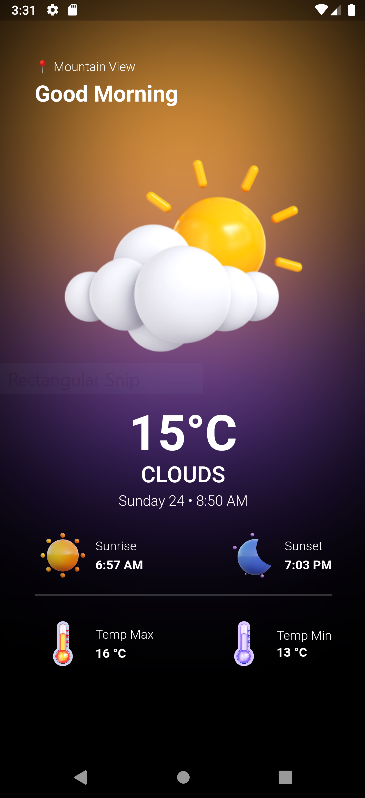

# weatherapiflutterbloc

Packages:::
    flutter_bloc: ^8.1.3
    equatable: ^2.0.5
   dio: ^5.3.3
   http: ^1.1.0
  shared_preferences: ^2.2.1
  weather: ^3.1.1
  intl: ^0.18.1
  geolocator: ^10.1.0
